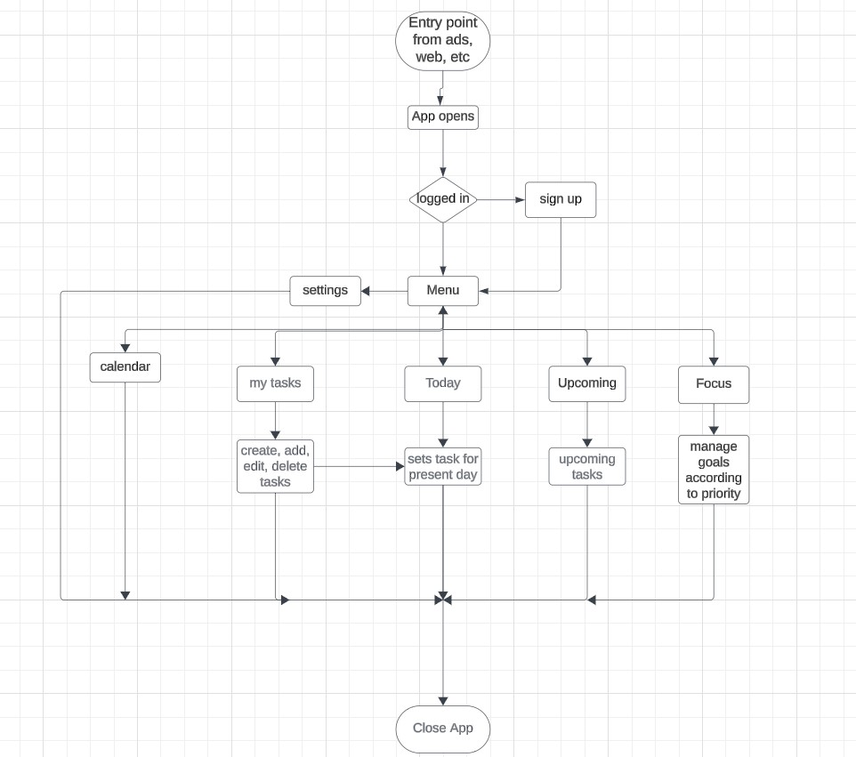

Table of content: 
Project overview 
Features and functionality 
Technologies used
Screenshots
Roadmapand future enhancements
Contact Information

Project Overview:
This TO_DOIT app serves as a helpful tools for users to efficiently manage and organise their task. Furthermore, the app contributes to uisers' personal development by incorporating specila features designed to manage and enhancepersonal growth based on inputs provided

Features and functionality:
1. Task management:Easily add, delete and edith tasks
2. Task Prioritization: Prioritize tasks by assigning different level of importance
3. Theme switch: Switch between white and dark mode for a soothing experience.
4. Authentication: 2_way authentiation for security purpose

Technologies used:
The technologies employed in building this project are:
* HTML
* CSS
* JAVASCRIPT

Screenshots:
Flowchart of the to_do list website

Roadmapand future enhancements:

Contact Information:
Maryann Okoye, 08142137122
twitter:
instagram:
